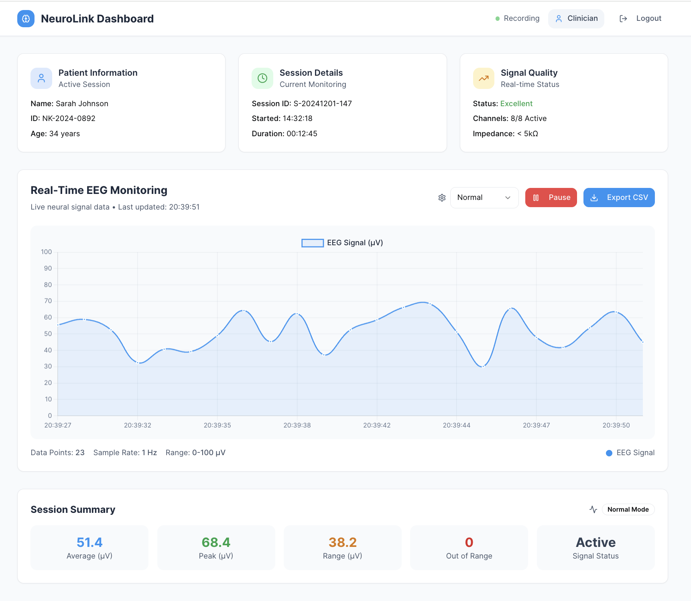
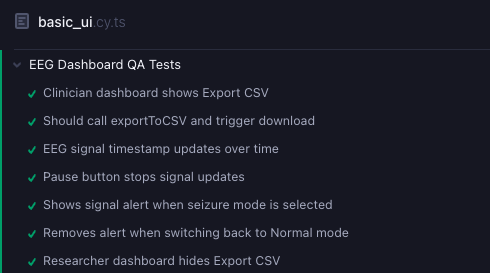
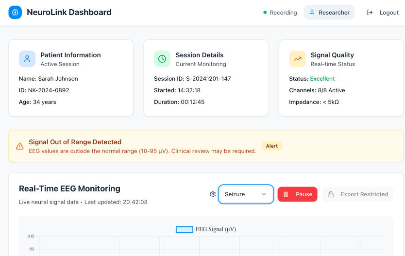

## 🧠 NeuroDash Simulator

A real-time EEG monitoring dashboard inspired by Firefly Neuro / Elminda. Built for clinician-facing data visualization and QA automation testing.

## 🚀 Live App
[Launch NeuroDash Simulator](https://neuro-dash-simulator.replit.app/)

## 🧪 Test-Driven QA Engineering

This project demonstrates advanced UI testing in a clinical simulation context using Cypress.

### ✅ Features Tested:

* Role-based dashboard access (Clinician vs Researcher)
* Conditional CSV export feature
* Real-time EEG signal updates and timestamp verification
* Pause/resume EEG signal flow
* Alert system for out-of-range brain signals
* UI response to signal mode changes (Normal, Seizure, Flatline)

## 📂 Tech Stack

* React + TypeScript
* Cypress for automated end-to-end testing
* Chart.js for EEG signal visualization
* Tailwind CSS + shadcn/ui components
* Replit for deployment

## 📸 Screenshots

*Add screenshots of:*

* Dashboard UI (Clinician view)
* Signal chart and timestamp
* Cypress tests passing
* Export CSV button and alert banner

## 📄 Test Plan Summary

See `cypress/e2e/basic_ui.cy.ts` for:

### 🧠 Clinician Dashboard


### ✅ Cypress Tests Passing


### ⚠️ Signal Alert Triggered



## 🧠 Notes on Alert Testing

To support predictable testing in Cypress, alert visibility is temporarily controlled in code:

```ts
if (mode === 'seizure' || mode === 'flatline') {
  setAlertVisible(true);
} else {
  setAlertVisible(false);
}
```

This ensures test reliability and will be removed or gated in production using `NODE_ENV`.

## 📦 Setup (Local Dev)

```bash
git clone https://github.com/lbehar/neuro-dash-simulator
cd neuro-dash-simulator
npm install
npx cypress open
```

## ✍️ Author

Leticia Behar — [@lbehar](https://github.com/lbehar)
